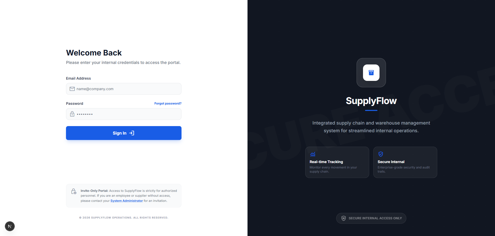
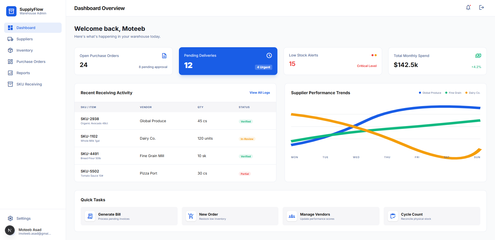
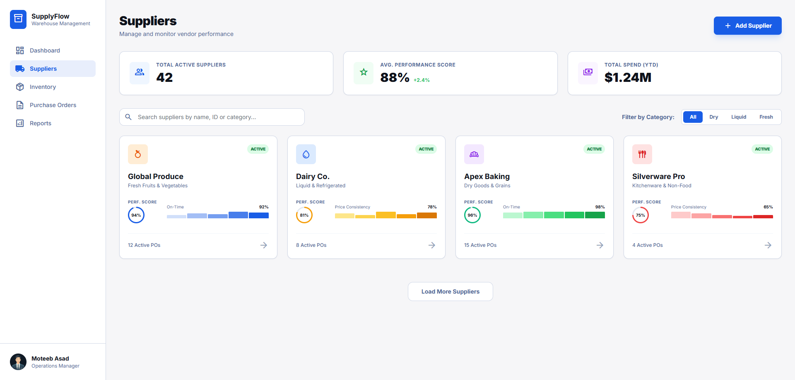
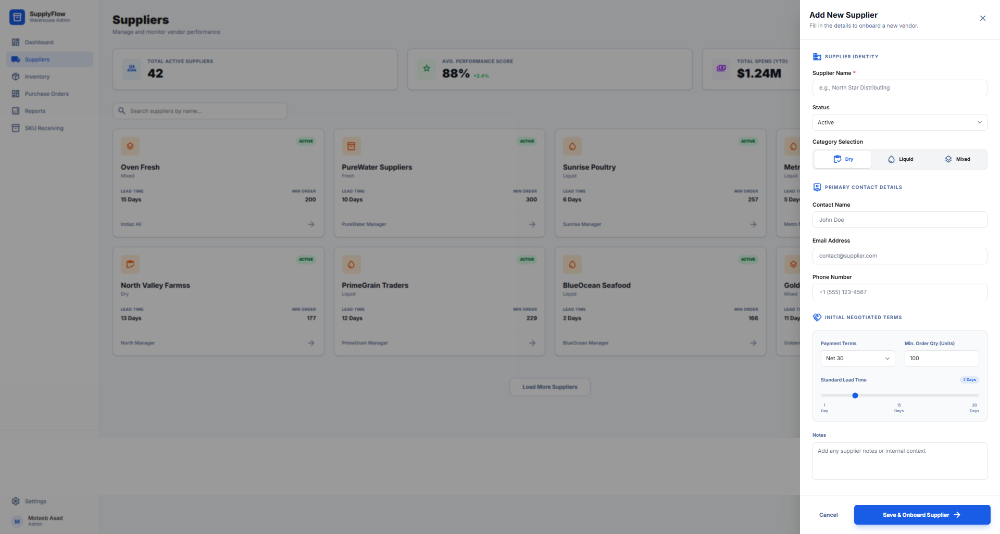
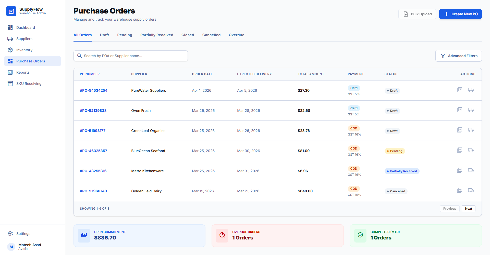
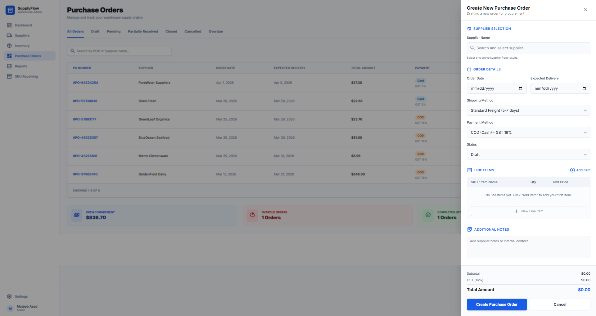

# SupplyFlow

## Overview

SupplyFlow is a B2B internal operations platform for supplier performance, inventory movement, and outlet stock operations.

It is designed to replace fragmented spreadsheets and manual follow-ups with a single role-aware workflow across receiving, issuing, and tracking.

Core outcomes:

- Better visibility into inventory inflow and outflow.
- Better supplier decisions using performance trends.
- Better execution speed for warehouse and outlet teams.
- Better control through role-based access.

## Problem It Solves

Operations teams often manage suppliers, stock movement, and outlet requests across disconnected tools, which causes delays, errors, and poor visibility.

SupplyFlow solves this by providing:

- A single place to track suppliers, inventory, and orders.
- Clear role-based workflows for warehouse and operations users.
- Faster decision-making through structured data and operational insights.
- Better accountability with traceable actions and centralized records.

## Features

- Secure authentication with Supabase Auth.
- Role-based access control for `super_admin`, `operations_manager`, and `store_keeper`.
- Supplier management and performance tracking.
- Inventory receiving and stock movement workflows.
- Purchase orders listing and operational tracking foundations.
- Analytics and reporting screens for operations monitoring.
- Responsive dashboard UI with shared layout and reusable table patterns.

### Screenshots

Result looks like:

<p align="left">
  
  
</p>

<p align="left">
  
  
</p>

<p align="left">
  
  
</p>

## Tech Stack

- Framework: Next.js 16.1.6 (App Router)
- React: 19.2.3
- Language: TypeScript (strict mode)
- Styling: Tailwind CSS v4
- Auth and database: Supabase (PostgreSQL)
- Data layer: Server actions + feature fetchers
- UI icons: Material Symbols Outlined

## Architecture

- App Router with server-first rendering.
- Route groups:
  - `(auth)` for login and password flows.
  - `(main)` for authenticated application routes.
- Nested layouts for persistent shell composition (sidebar/header).
- Feature-based organization under `src/features`.
- Reusable UI system under `src/components`.
- Shared permission and navigation logic under `lib`.

## Environment Variables

Create `.env.local` in the project root (or copy from `.env.example`):

```bash
NEXT_PUBLIC_SUPABASE_URL=your_supabase_project_url
NEXT_PUBLIC_SUPABASE_ANON_KEY=your_supabase_anon_key
NEXT_PUBLIC_SITE_URL=http://localhost:3000

SUPABASE_URL=your_supabase_project_url
SUPABASE_ANON_KEY=your_supabase_anon_key
SUPABASE_SERVICE_ROLE_KEY=your_service_role_key

ROOT_ADMIN_EMAIL=admin@example.com
ROOT_ADMIN_PASSWORD=your_secure_password
```

| Variable                        | Description                                     | Required |
| ------------------------------- | ----------------------------------------------- | -------- |
| `NEXT_PUBLIC_SUPABASE_URL`      | Supabase project URL (client + server usage)    | Yes      |
| `NEXT_PUBLIC_SUPABASE_ANON_KEY` | Supabase anonymous key                          | Yes      |
| `NEXT_PUBLIC_SITE_URL`          | Base URL used for auth and email redirects      | Yes      |
| `SUPABASE_URL`                  | Supabase project URL for scripts                | Optional |
| `SUPABASE_ANON_KEY`             | Supabase anon key for scripts                   | Optional |
| `SUPABASE_SERVICE_ROLE_KEY`     | Service role key for admin scripts              | Optional |
| `ROOT_ADMIN_EMAIL`              | Seed root admin email (used by setup script)    | Optional |
| `ROOT_ADMIN_PASSWORD`           | Seed root admin password (used by setup script) | Optional |

Notes:

- Do not commit real secrets in `.env` or `.env.local`.
- For production, set `NEXT_PUBLIC_SITE_URL` to your deployed domain.

## Authentication & Access Control

### User Roles

1. Super Admin (`super_admin`)

- Full system access.
- User and permission management.
- Audit and governance visibility.

2. Operations Manager (`operations_manager`)

- Supplier and inventory oversight.
- Purchase order and stock movement workflows.
- Operations analytics and reporting.

3. Store Keeper (`store_keeper`)

- SKU receiving and stock execution tasks.
- Operational inventory handling.

### Route Permissions

Access is enforced by role-aware UI and server-side permission checks.

- `/dashboard`: all authenticated users.
- `/suppliers`: super admin and operations manager.
- `/purchase-orders`: super admin and operations manager.
- `/inventory/*`: operations manager and store keeper (with role-specific capabilities).
- `/settings/*`: super admin.

## Getting Started

### Prerequisites

- Node.js 18+
- npm
- Supabase project

### Installation

1. Clone the repository.

```bash
git clone https://github.com/moteeb-asad/supply-flow.git
cd supply-flow
```

2. Install dependencies.

```bash
npm install
```

3. Configure environment variables.

```bash
NEXT_PUBLIC_SUPABASE_URL=your_project_url
NEXT_PUBLIC_SUPABASE_ANON_KEY=your_anon_key
```

4. Apply database migrations from `supabase/migrations/` in your Supabase project.

5. Run development server.

```bash
npm run dev
```

App runs at `http://localhost:3000`.

### Build for Production

```bash
npm run build
npm start
```

## Testing

- Linting: `npm run lint`
- Type checking: TypeScript strict mode is enabled
- CI: lint + build checks on pull requests to `develop` and `main`

## Roadmap

Short-term:

- Complete purchase order add/edit and detail workflows.
- Expand inventory receive and issue actions.
- Improve supplier insights and drill-down metrics.

Mid-term:

- Outlet-level stock planning and forecasting.
- Alerting for delayed deliveries and low stock.
- Advanced reporting exports.

Long-term:

- Multi-warehouse orchestration.
- Barcode and scanner-assisted operations.
- Predictive replenishment and supplier recommendations.
